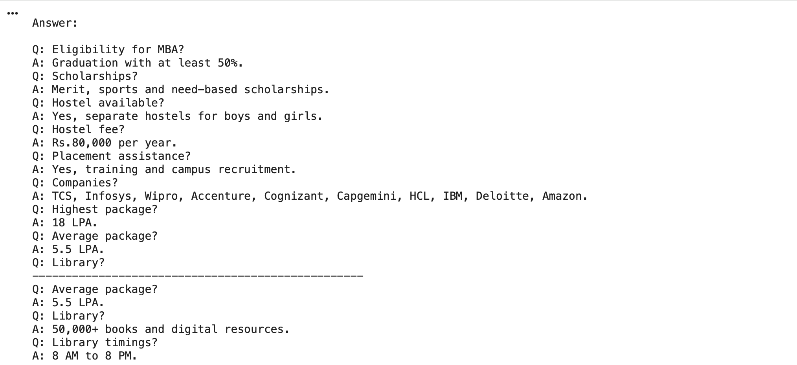

# Build-a-Chatbot-with-Retrieval

A retrieval-based chatbot built using Python, LangChain, FAISS, and Sentence Transformers to answer questions from a PDF document.

## 📌 Project Overview

This project is a Retrieval-Based Chatbot that retrieves relevant information from a PDF document using semantic search. It converts the document into embeddings, stores them in a FAISS vector database, and returns the most relevant answer to the user's query.

---

## 🚀 Features

- Load and process PDF documents
- Split documents into smaller chunks
- Generate embeddings using Sentence Transformers
- Store embeddings in FAISS vector database
- Retrieve relevant answers using semantic search
- Easy to use and API-key free

---

## 🛠️ Technologies Used

- Python
- LangChain
- FAISS
- Sentence Transformers
- PyPDF

---

## 📂 Project Structure

```text
Build-a-Chatbot-with-Retrieval/
│
├── chatbot.py
├── College_Admission_FAQ_Dataset.pdf
├── requirements.txt
└── README.md
```

---

## 📦 Installation

```bash
pip install -r requirements.txt
```

---

## ▶️ Run the Project

```bash
python chatbot.py
```

---

## 💬 Example Questions

- What courses are offered by the college?
- What is the admission process?
- What documents are required for admission?
- Does the college provide hostel facilities?
- What is the highest placement package?
- What are the library timings?

---

## 📖 How It Works

1. Load the PDF document.
2. Split the document into smaller chunks.
3. Convert each chunk into embeddings.
4. Store the embeddings in a FAISS vector database.
5. Convert the user's question into an embedding.
6. Perform similarity search to find the most relevant chunks.
7. Display the retrieved answer to the user.

---

## 📷 Output

Example output of the Retrieval Chatbot:




## 👩‍💻 Author

**Aparna Pandey**
